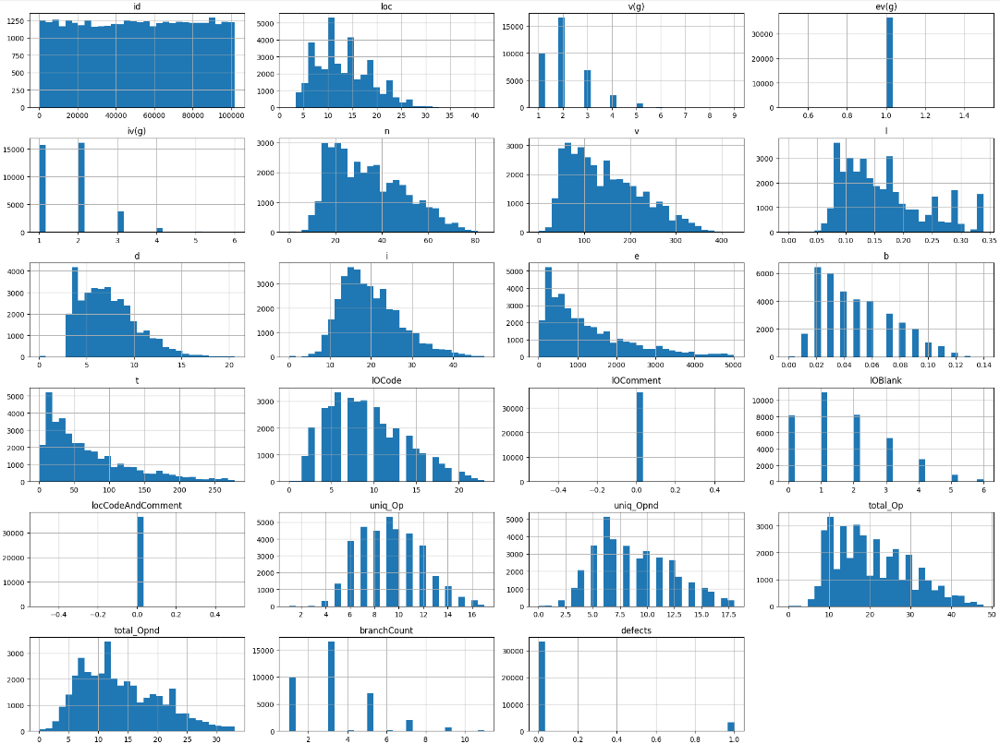

# Project Title

* This repository holds an attempt to apply RandomForestClassifer to predict software defects using synthetic data from the "Binary Classification with a Software Defects Dataset" Kaggle challenge
((https://www.kaggle.com/competitions/playground-series-s3e23/overview)). 

## Overview

* The task, as defined by the Kaggle challenge is to use 23 features (target included) of software metrics to predict software defects.
* The approach in this repository formulates the problem as a binary classification task using a Random Forest Classifier. The data is processed through cleaning, scaling, and is trained and evaluated through test splits and accuracy methods.
* The model was able to predict software defects within 66%. Although almost passing and taking into consideration the class imbalance, I believe more could have been done to achieve better results. 

## Summary of Workdone

### Data

* Data:
  * Type: 
    * Input: CSV file of data with multiple numeric features.
    * Output: Binary classification (defects column), where 1 indicates a defect and 0 indicates no defect.
  * Size: A (101763 rows, 23 column) size CSV file, taking 10.4 MB.
  * Instances (Train, Test, Validation Split): how many data points? 60% training, 20% testing, 20% validation.

#### Preprocessing / Clean up

* Cleaned the data by removing the IQR outliers.
* Scaled the cleaned data using the MinMaxScaler.
* No one-hot encoding.

#### Data Visualization

Show a few visualization of the data and say a few words about what you see.

* Picture of the histograms of all features before any processing.

* Picture of the histograms of all features after cleaning using IQR only. Data is much more concise after cleaning.

* Picture of the histograms of all features after cleaning then scaling. Excluding id, data seems more similar to the cleaning only, with the exception of the values and range of values.

### Problem Formulation

* Define:
  * Input / Output : Data from CSV (excluding id and defects) / Binary label defects
  * Models
    * Random Forest Classifier : Simplicity, Ability to handle imbalanced data, interpretability. 
  * Loss, Optimizer, other Hyperparameters.
    * n_estimators = 100 (number of trees)
    * max_depth = 5 (limits depth to reduce overfitting)
    * max_features = 1 (number of features at each split)
    * class_weight = 'balanced' (helps handle class imbalance)

### Training

* Describe the training:
  * How you trained:
    * Random Forest Classifier with cleaned/scaled data that was split 60/20/20. Used Python on Jupyter on a 8gb RAM laptop.
  * How did training take :
    * less than a minute.
  * Training curves (loss vs epoch for test/train) :
    * No curves for Random Forest Classifier.
  * How did you decide to stop training :
    * Model was trained with a fixed number of trees (100).
  * Any difficulties? How did you resolve them?
    * The dataset had a skewed class distribution.
      * Used class_weight = 'balanced' when training the model to fix the issue.
    * I attempted to preserve the positive values of the data.
      * Although the data is synthetic, I attempted to keep some realism by keeping all values positive with MinMaxScaler instead of other scalers. 
    * Processing the data made the class distribution worse, which influenced the modeling.
      * With my first approach, I attempted to clean the data using IQR without scaling since I noticed the data looked "suitable" without the scaling and I was dissatisfied with some values,
        only to realize later on that the accuracy provided by the model was lower than I expected.
      * With my second approach, I attempted to scale the data using MinMaxScaler without cleaning since I noticed the class distribution was maintained from the original uncleaned data.
        This did lead to higher accuracy from the model, but I reasoned that it was more than likely some sort of false positives and opted against it.
      * With my final approach, I cleaned the data using IQR and then scaled using MinMaxScaler. Although the accuracy was very comparable to my first approach with just cleaning the data,
        I felt it was better suited for modeling due to it going through both standard procedures of cleaning and scaling.  

### Performance Comparison

* Clearly define the key performance metric(s).
  * Accuracy: Measures the correctness of predictions.
  * Precision, Recall, F1-score: Part of the classification report.
  * AUC-ROC: Measures models ability to tell apart classes at different thresholds.
  * Confusion Matrix: Gives insight into false positives and negatives.
* Show/compare results in one table.

* Show one (or few) visualization(s) of results, for example ROC curves.

### Conclusions

* State any conclusions you can infer from your work.
  * The class imbalance issue severely impacted my modeling, and it could have been handled better.
  * The order of cleaning and scaling matter when modeling, especially when looking for the best results.
  * Cross-validation, scores and reports help provide estimates to give some confirmation to results.

### Future Work

* What would be the next thing that you would try.
  * I could attempt another way to clean the data other than IQR, such as Z-score and such.
  * I could attempt another way to scale the data other than MinMaxScaler even if it means making some of the data negative,
    such as the StandardScaler or Robust I opted against at first since I wanted to keep the data in the positives.
  * I could attempt other ML models such as Gradient, Gaussian, and Logistic Regression.
  * I could attempt to use different hyperparameters on the Random Forest model.
* What are some other studies that can be done starting from here.
  * Potentially integrate the software detection model into GitHub to warn against commits that may have defects in them. 

## How to reproduce results

* 1.) Download all relevant files from this repository (Kaggle Tabular Data (1).ipynb, train.csv, test.csv)
* 2.) Install relevant python packages (pandas, numpy, maplotlib, tabulate, seaborn, scikit-learn, IPython.display)
* 3.) Run Kaggle Tabular Data (1).ipynb from start to finish in IDE

### Software Setup
* pandas
* numpy
* maplotlib
* tabulate
* seaborn
* scikit-learn
* IPython.display

### Data

* (https://www.kaggle.com/competitions/playground-series-s3e23/overview)

### Training

* 1.) Prepare data
  * id and defects are removed
  * Process the data through cleaning (IQR) and scaling (MinMaxScaler)
* 2.) Training
  * Split data 60-20-20
  * Train a RandomForestClassifier with class_weight = 'balanced'
  * Evaluate performance usign accuracy, confusion matrix, classification report, and ROC curve.

